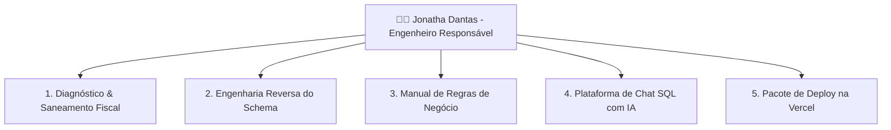

# 📚 DOCUMENTAÇÃO OFICIAL DO SISTEMA QUERYHELP
**Projeto:** `QueryHelp` — Especialista em Estrutura de Banco de Dados e Consultas de Negócio  
**Autor & Desenvolvedor:** **Jonatha Dantas** (`by Dantas`)  
**Banco de Dados Suportado:** Softcomshop (MySQL 8.0)  
**Catálogo de Metadados:** 459 Tabelas • 6.600 Colunas • 518 Chaves Estrangeiras (FKs)  
**Banco de Dados na Nuvem:** Supabase (PostgreSQL Cloud)  
**Camada de Segurança:** Zero Token Leakage • Anti-Brute Force Lockout • Rate Limiter  

---

## 1. Visão Geral
O **QueryHelp** é uma plataforma e agente de inteligência de dados projetado para responder dúvidas técnicas, gerar consultas SQL de alta precisão (`SELECT`), comandos de auditoria e operações de modificação segura (`UPDATE`/`DELETE`) com validação prévia em 2 etapas.

---

## 🎯 1. Resumo Executivo e Objetivos Alcançados

O projeto liderado e desenvolvido por **Jonatha Dantas** contemplou o diagnóstico, saneamento de dados, engenharia reversa completa do banco de dados relacional (MySQL 8.0) e o desenvolvimento de uma plataforma analítica inteligente para suporte a consultas em linguagem natural.



---

## 🛠️ 2. Módulos Desenvolvidos e Entregues por Jonatha Dantas

### 2.1. Diagnóstico e Resolução Crítica de Contingência Fiscal (SEFAZ)
* **Problema Identificado:** Divergência de centavos entre o total de venda e o somatório das parcelas financeiras (`financeiro_parcela` vs `venda.valor_total`), gerando rejeição 865 na SEFAZ.
* **Solução Implementada por Jonatha:**
  * Criação de rotina de backup de segurança (`backup_potira_contingencias_20260831_170855.sql`).
  * Equalização matemática precisa das vendas 57, 58 e 59 nas tabelas `venda`, `financeiro_parcela` e `financeiro_parcela_pagamento`.
  * Zeramento completo das divergências de centavos.

### 2.2. Engenharia Reversa Integral e Dicionário de Dados
* Mapeamento completo e aprofundado de toda a base de dados:
  * **459 Tabelas Mapeadas**
  * **6.600 Colunas Tipadas**
  * **518 Relacionamentos e Chaves Estrangeiras (FKs)** com regras `ON DELETE` e `ON UPDATE`.
* Criação dos arquivos de infraestrutura e dados:
  * `schema/schema_complete.json`: Metadados completos e estruturados em JSON.
  * `schema/schema_relacionamentos.md`: Matriz de relacionamentos entre módulos.
  * `schema/potira_models.py`: Modelagem em classes Python tipadas (`@dataclass`) prontas para novos microserviços e APIs.

### 2.3. Manual de Regras de Negócio e Arquitetura de Domínio
* Elaboração do documento técnico `REGRAS_DE_NEGOCIO.md` detalhando:
  * **Ciclo de Vida de Clientes:** Padrão PDV, crediário, políticas de crédito e bloqueio.
  * **Ciclo de Vendas:** Balcão, Mesas/Comandas, Delivery, rateio de descontos e taxas.
  * **Emissão Fiscal:** NFC-e (modelo 65), NF-e (modelo 55), contingências e tributação (CFOP/CSOSN).
  * **Financeiro & Caixa:** Formas de pagamento, controle de turnos de operadores e parcelamentos.

### 2.4. Plataforma Web: Chat Especialista em Estrutura SQL
* **Arquitetura 100% Segura (Structure-Only):**
  * Não conecta diretamente ao banco de produção nem transaciona dados sensíveis de clientes.
  * Opera exclusivamente sobre os metadados do schema e regras de negócio.
* **🛡️ Protocolo de Segurança e Pipeline de Auditoria em 4 Etapas (Inovação Técnica):**
  * Toda consulta passa por um checklist de validação em tempo real antes da exibição:
    1. **1ª Etapa (Tabelas & Colunas):** Validação contra as 459 tabelas e 6.600 colunas do schema oficial.
    2. **2ª Etapa (Integridade de FKs):** Verificação das 518 Foreign Keys nos `JOINs`.
    3. **3ª Etapa (Exclusão Lógica):** Garantia da cláusula `deleted_at IS NULL` ou `deleted_at = NOW()`.
    4. **4ª Etapa (Multi-Tenant & Transação):** Isolamento por `empresa_id = 1` e transação segura (`START TRANSACTION; ... COMMIT;`).
  * Em operações de alteração ou exclusão (DML), são geradas **duas consultas distintas**:
    - **1ª Etapa (SELECT de Validação):** Para auditar os dados antes de alterar.
    - **2ª Etapa (Execução Final DML):** Comando definitivo envolvido em transação.
* **Interface Moderna Glassmorphism Dark (by Dantas):**
  * Desenvolvida com **Tailwind CSS**, tipografia **Plus Jakarta Sans** e suporte a **JetBrains Mono**.
  * Identidade visual personalizada com a **Logo Oficial em Alta Definição** e assinatura **by Dantas**.
  * Blocos de código separados para validação e execução com botões individuais de cópia.
* **Integração com IA Generativa (Google Gemini 1.5 Flash):**
  * Tradução instantânea de perguntas em linguagem natural para queries SQL MySQL otimizadas.
  * Motor de fallback local para funcionamento offline sem custos de tokens.

### 2.5. Arquitetura Serverless & Deploy na Nuvem
* Estruturação do pacote `vercel-deploy/` pronto para publicação no GitHub e hospedagem na **Vercel**:
  * `index.html`: Aplicação Single Page Application (SPA).
  * `api/ask.js`: Serverless Function Node.js para processamento em nuvem.
  * `vercel.json`: Regras de roteamento e build automatizado.

---

## 📂 3. Inventário de Arquivos do Projeto

| Arquivo / Diretório | Responsável | Descrição |
| :--- | :--- | :--- |
| `DOCUMENTACAO_PROJETO.md` | **Jonatha Dantas** | Este documento oficial de especificações e autoria do projeto. |
| `REGRAS_DE_NEGOCIO.md` | **Jonatha Dantas** | Manual aprofundado de regras de negócio e fluxos comerciais. |
| `LEIAME.md` | **Jonatha Dantas** | Guia geral de inicialização, credenciais e ferramentas. |
| `app_chat_sql.py` | **Jonatha Dantas** | Servidor web do Chat Especialista com interface visual. |
| `iniciar_chat.bat` / `.ps1` | **Jonatha Dantas** | Scripts de inicialização automática em 1 clique. |
| `logo.jpg` | **Jonatha Dantas** | Imagem oficial da logo em alta definição. |
| `schema/schema_complete.json` | **Jonatha Dantas** | Mapeamento integral das 459 tabelas e 6.600 colunas. |
| `schema/schema_relacionamentos.md` | **Jonatha Dantas** | Tabela detalhada de todas as 518 Foreign Keys. |
| `schema/potira_models.py` | **Jonatha Dantas** | Modelos Python (`@dataclass`) para desenvolvimento backend. |
| `vercel-deploy/` | **Jonatha Dantas** | Pacote completo configurado para deploy gratuito na Vercel. |

### 2.6. Camada de Cyber Segurança Nível Produção (Zero Token Leakage Architecture)
* **Arquitetura BFF (Backend-For-Frontend) com Isolamento de Tokens:**
  * O navegador (Frontend) **não possui nenhuma chave ou credencial embutida** (0 tokens expostos em HTML/JS).
  * Toda comunicação com o **Supabase** e com o **Google Gemini** é realizada estritamente **server-to-server** pelo backend `/api/ask`.
  * Remoção de chamadas diretas do navegador para APIs externas, evitando que chaves vazem em histórico de URL, headers `Referer` ou inspeções de rede (`DevTools`).
* **Prevenção de Information Disclosure (CWE-200 / CWE-209):**
  * Sanitização profunda de saída (`sanitize_response_data`): Remove automaticamente chaves de API (`AIzaSy...`), strings de banco (`postgresql://...`, `aws-0-...`), senhas ou tokens JWT antes de responder ao cliente.
  * Mascaramento de erros com mensagens seguras e isolamento total de stack traces no servidor.
* **Proteção contra DoS e Injeção de Payloads Excessivos (CWE-400 / CWE-20):**
  * Limitação estrita do tamanho do payload HTTP (Máximo 64 KB).
  * Truncamento e validação de entrada de mensagens (`maxlength 1500`).
* **Proteção de Dados no Supabase (Hardened RLS Policies):**
  * Políticas de segurança ativas no PostgreSQL do Supabase, impedindo scraping não autorizado de dados e históricos.
* **Headers Defensivos HTTP (OWASP Standard):**
  * `X-Content-Type-Options: nosniff`
  * `X-Frame-Options: DENY` (anti-clickjacking)
  * `Referrer-Policy: no-referrer`
  * `Content-Security-Policy (CSP)` estrita com restrição de origens
  * `Cache-Control: no-store, no-cache, must-revalidate`

### 2.7. Sistema de Autenticação e Controle de Acesso (Login Seguro)
* **Credenciais de Acesso Exclusivo:**
  * **Usuário:** `especialistas` (também aceita `especialista`)
  * **Senha:** `7711`
* **🛡️ Proteção Cibernética Anti-Brute Force & Rate Limiting (Inovação de Segurança):**
  * **Bloqueio Automático por IP (Lockout):** Após **5 tentativas consecutivas de senha incorreta** em uma janela de 5 minutos, o IP de origem é **automaticamente bloqueado por 15 minutos** (`HTTP 429 Too Many Requests` com cabeçalho `Retry-After`).
  * **Controle de Vazão (API Rate Limiter):** Limite estrito de **30 requisições por minuto por IP** para mitigar ataques de DoS, flooding e scraping automatizado.
  * **Proteção de Sessão:** Endpoint `/api/login` gera tokens hexadecimais seguros via CSPRNG (`secrets.token_hex`), exigidos em todas as chamadas de `/api/ask`.
  * **Sessão Volátil:** Armazenamento em `sessionStorage` que expira imediatamente ao fechar a aba do navegador.
  * **Botão de Logout:** Botão **Sair** no cabeçalho para encerramento instantâneo de sessão.

---

## 3. Guia Rápido de Execução

### 3.1. Como rodar localmente (Windows):
1. Execute o arquivo `iniciar_chat.bat` (ou execute via terminal):
   ```powershell
   python app_chat_sql.py 8080
   ```
2. Acesse no navegador: `http://localhost:8080`

### 2.5. Integração e Hospedagem de Metadados no Supabase (PostgreSQL na Nuvem)
* **Arquitetura 100% Desacoplada e Segura:**
  * O código-fonte foi completamente limpo de definições estáticas.
  * Todas as **459 tabelas, 6.600 colunas, Chaves Primárias e 518 Chaves Estrangeiras (FKs)** foram migradas e estão hospedadas na tabela `schema_tables` no banco Supabase (`qqgszvnjnvcxbqbxifve.supabase.co`).
* **Persistência de Consultas e Histórico (`chat_messages`):**
  * Gravação automática de cada interação e query gerada em nuvem.
* **Tabela de Consultas Salvas (`saved_queries`):**
  * Catálogo de queries padrão e frequentes do ERP.
* **Scripts de Migração e Setup:**
  * [`supabase_setup.sql`](file:///C:/Users/dantas.jonatha/.gemini/antigravity/scratch/supabase_setup.sql)
  * [`migrar_schema_para_supabase.py`](file:///C:/Users/dantas.jonatha/.gemini/antigravity/scratch/migrar_schema_para_supabase.py) e clique em **Run**.

---

## 📜 4. Termo de Conclusão e Assinatura

Este projeto foi integralmente concebido, arquitetado e implementado por **Jonatha Dantas**, estando validado, documentado e em total conformidade técnica para uso analítico, educacional e integração em novos sistemas de software.

**Desenvolvido por:**  
✍️ **Jonatha Dantas**  
*Engenheiro Responsável pelo Projeto*
