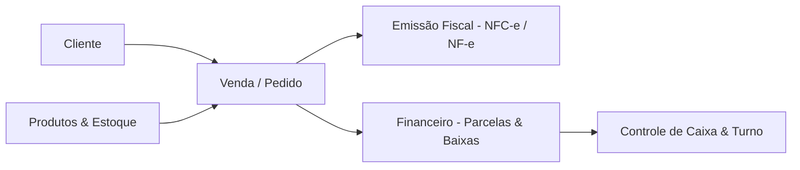
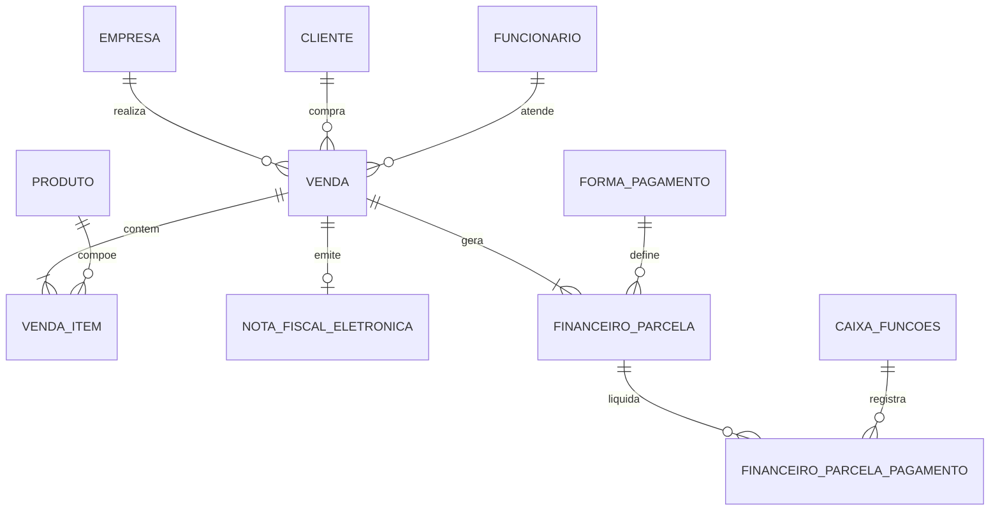

# 📘 Manual de Regras de Negócio & Arquitetura de Domínio
## Sistema de Gestão Comercial e PDV (Softcomshop)

Este documento descreve detalhadamente as regras de negócio, ciclo de vida das entidades, fluxos operacionais e relacionamento entre os módulos de **Clientes, Vendas (PDV/Mesas), Fiscal (NFC-e/NF-e) e Financeiro**, estruturado a partir da engenharia reversa e mapeamento do banco de dados `softcoms_softcomshop_lanchoneteerestaurantepotira`.

---

## 🧭 1. Visão Geral da Arquitetura do Sistema

O sistema opera no modelo de **Automação Comercial Multi-Empresa** voltado para varejo, lanchonetes e restaurantes, integrando quatro pilares fundamentais:

---

## 👥 2. Domínio de Clientes (Customer Lifecycle)

### 2.1. Tipos de Clientes e Identificação
1. **Consumidor Não Identificado (Padrão PDV):**
   * Registrado na tabela `cliente` com `id = 1` (`nome = 'CONSUMIDOR'`, `cpf_cnpj = ''`, `tipo_pessoa = 'FISICA'`).
   * No ato da venda, o operador pode registrar o CPF na nota sem criar um cadastro completo através dos campos `venda.api_cliente_cpf` e `venda.api_cliente_nome`.
2. **Cliente Cadastrado Completo:**
   * Utilizado para vendas a prazo (crediário), faturamento, delivery ou controle de fidelidade.
   * `tipo_pessoa`: `'FISICA'` (CPF) ou `'JURIDICA'` (CNPJ).
   * Vínculo com tabelas satélites: `cliente_endereco` (endereço principal/entrega), `cliente_contato` (telefone/e-mail), `cliente_condicao_pagamento` (tabelas de preço e prazos permitidos).

### 2.2. Regras Comerciais e Limite de Crédito
* **Controle de Inadimplência:** O campo `cliente.bloqueado` (ou status na tabela `cliente_bloqueio`) impede novas vendas a prazo.
* **Limite de Crédito:** `cliente.limite_credito` define o teto máximo de saldo devedor em aberto na tabela `financeiro_parcela` (`valor_parcela - valor_pago > 0` onde `cancelada = 0`).

---

## 🛒 3. Domínio de Vendas (Sales Lifecycle)

### 3.1. Origens e Modalidades de Venda (`venda.origem_venda`)
O sistema suporta múltiplas operações simultâneas:
* **Venda Direta (Balcão / PDV Express):** Venda rápida no caixa com baixa e emissão fiscal imediatas.
* **Mesas / Comandas (Restaurante):** Lançamento contínuo de itens vinculados a `venda.numero_mesa` e `venda.numero_comanda`, com suporte a taxa de serviço (`venda.total_acrescimo` / `cobrar_taxa_servico`).
* **Delivery:** Pedido com entrega domiciliar vinculado a `cliente_endereco_id`, `entregador_id`, `comissao_entregador` e taxa de entrega.

### 3.2. Estrutura e Cálculo de Valores da Venda
A tabela `venda` atua como o agregado raiz (Root Aggregate):

$$\text{valor\_total} = \sum (\text{item.preco} \times \text{item.quantidade}) - \text{total\_desconto} + \text{total\_acrescimo}$$

* **Itens (`venda_item`):**
  * `preco`: Preço unitário praticado na venda.
  * `quantidade`: Quantidade comercializada (suporta fracionamento decimal, ex: peso/balança `decimal(15,4)`).
  * `preco_compra`: Custo do produto no momento da venda (permite apuração de margem de lucro).
  * `desconto_valor_item` e `acrescimo_valor_item`: Descontos ou acréscimos aplicados diretamente ao item.
  * `comissao_atendente`: Comissão calculada para o garçom/vendedor (`funcionario_id`).

### 3.3. Regra Crítica: Rateio de Desconto e Divergência de Centavos
Quando um desconto global é informado no fechamento da venda (ex: R$ 1,89):
1. O sistema divide o desconto proporcionalmente entre os itens da venda (`venda_item.desconto_valor_item`).
2. Devido a arredondamentos decimais nos itens, a soma dos valores líquidos dos itens na NFC-e pode resultar em uma diferença de **$\pm$ R$ 0,01** em relação ao total da venda no PDV.
3. **Regra de Ouro:** O total de pagamentos registrado (`venda.total_pagamento` e `financeiro_parcela.valor_parcela`) **deve ser rigorosamente idêntico** ao `total_nota_valor` da nota fiscal para evitar rejeição fiscal na SEFAZ.

### 3.4. Ciclo de Estados da Venda (`venda.status`)
* **`ABERTA`:** Venda em digitação, mesa/comanda aberta ou aguardando pagamento.
* **`PAGO` / `FINALIZADA`:** Pagamento confirmado, estoque baixado, financeiro gerado e nota autorizada.
* **`CANCELADA`:** Venda cancelada pelo operador (`usuario_cancelamento_id`, `data_hora_cancelamento`, `motivo_cancelamento`). Estorna parcelas e devolve itens ao estoque.

---

## 🧾 4. Domínio Fiscal (NFC-e & NF-e)

### 4.1. Emissão de Documentos Fiscais
* **NFC-e (Nota Fiscal de Consumidor Eletrônica - Modelo 65):** Utilizada no varejo e balcão.
* **NF-e (Nota Fiscal Eletrônica - Modelo 55):** Utilizada para vendas com entrega interestadual, faturamento para PJ com IE ou transporte com frete.
* **Chave de Acesso:** Composta por 44 dígitos numéricos (`cUF + AAMM + CNPJ + mod + serie + nNF + tpEmis + cNF + cDV`).

### 4.2. Tributação e Vínculos Fiscais (`vinculos_fiscais`)
Cada produto (`produto_id`) possui parametrização fiscal por UF de origem/destino:
* **CFOP:** `5102` (Venda de mercadoria tributada) ou `5405` (Venda de mercadoria com Substituição Tributária - ST).
* **CSOSN (Simples Nacional):**
  * `102` / `103`: Tributada pelo Simples Nacional sem permissão de crédito.
  * `500`: ICMS cobrado anteriormente por substituição tributária (Substituído).
* **PIS / COFINS:** `04` / `06` (Monofásico / Alíquota Zero para bebidas/combustíveis).

### 4.3. Contingência Offline (`recibo_situacao = 'CONTINGENCIA'`)
* Em caso de queda de internet ou instabilidade da SEFAZ, o PDV emite a NFC-e em contingência offline (`tipo_emissao = 9`).
* O cliente recebe o cupom com o QR Code de contingência e a empresa tem o prazo legal (geralmente 24h) para transmitir o lote à SEFAZ.
* **Rejeição 865 (SEFAZ):** `Rejeição: Total dos pagamentos menor que o total da nota`.
  * Ocorre quando $\sum \text{vPag} < \text{vNF}$.
  * **Solução de Negócio:** Equalizar `financeiro_parcela.valor_parcela` e `financeiro_parcela_pagamento.valor_pago` com o total exato da nota antes do reenvio.

---

## 💰 5. Domínio Financeiro & Caixa

### 5.1. Formas de Pagamento (`forma_pagamento`)
* `DINHEIRO`: Movimenta o caixa físico instantaneamente.
* `PIX`: Baixa automática com código de transação / QR Code.
* `CARTAO_DEBITO` / `CARTAO_CREDITO`: Gera registro em `venda_cartao` com taxa de administração e código de autorização.
* `A_PRAZO` / `CREDIARIO`: Gera parcelas futuras a receber com data de vencimento.

### 5.2. Estrutura de Parcelas e Baixas
1. **Geração da Parcela (`financeiro_parcela`):**
   * Criada no momento da finalização da venda (`venda_id`, `empresa_id`, `valor_parcela`, `vencimento`).
   * Parcela única à vista é identificada como `'01/01'`.
2. **Registro da Baixa / Liquidação (`financeiro_parcela_pagamento`):**
   * Para pagamentos à vista, o registro de baixa é gerado no mesmo milissegundo da venda (`valor_pago`, `valor_recebido`, `data_pagamento`, `forma_pagamento_baixa_id`).
   * Vínculo direto com a sessão do operador de caixa (`caixa_funcoes_id`, `caixa_turno`).

### 5.3. Controle de Caixa (`caixa_funcoes`)
* **Abertura de Caixa:** Define saldo inicial (fundo de troco).
* **Suprimento:** Entrada avulsa de valores no caixa.
* **Sangria:** Retirada de valores para cofre/depósito.
* **Fechamento de Caixa:** Confronta o saldo esperado do sistema com a contagem física do operador por forma de pagamento.

---

## 📐 6. Matriz de Entidades e Relacionamentos Chave

---

## 💡 7. Diretrizes Técnicas para o Futuro Projeto

Ao desenvolver novas aplicações, APIs ou microsserviços integrados a esta base:

1. **Uso de Transações ACID:**
   * Toda finalização de venda deve agrupar `venda`, `venda_item`, `financeiro_parcela`, `financeiro_parcela_pagamento` e `nota_fiscal_eletronica` dentro de uma única transação atômica (`BEGIN ... COMMIT / ROLLBACK`).
2. **Precisão Numérica Decimal:**
   * Utilizar sempre tipos de ponto fixo (`Decimal` em Python, `BigDecimal` em Java/C# ou `numeric` em SQL) com 2 casas para exibição e 4 casas decimais para cálculos intermediários (`decimal(15,4)`). Nunca usar `float`/`double` para valores monetários.
3. **Soft Deletes:**
   * O sistema adota a convenção de Soft Delete através da coluna `deleted_at IS NULL`. Todas as queries de busca ativa devem respeitar esse filtro.
4. **Multi-empresa (Tenant):**
   * Sempre incluir a cláusula `empresa_id = :empresa_id` em consultas e atualizações para garantir o isolamento correto dos dados da filial.
5. **Modelos Prontos:**
   * Utilize o arquivo `schema/potira_models.py` para instanciar classes de dados tipadas e `potira_db.py` para comunicação direta e rápida com o MySQL.
